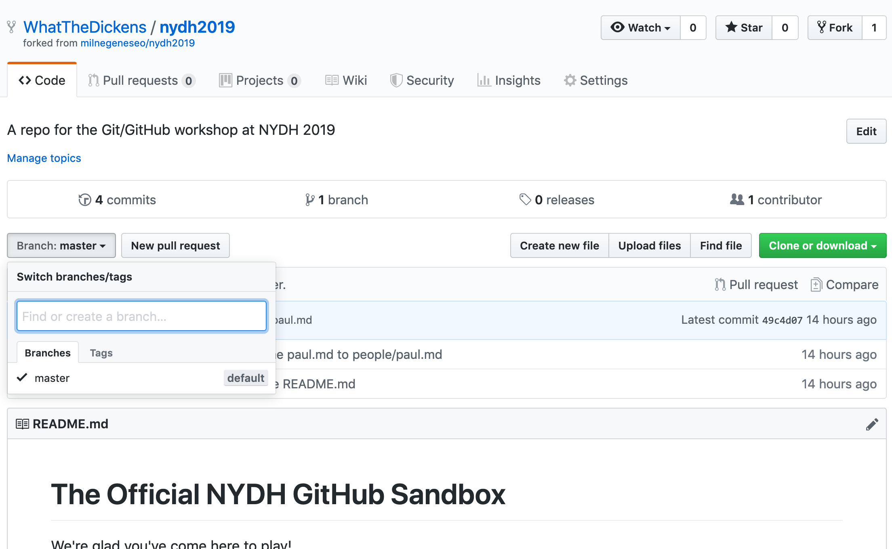
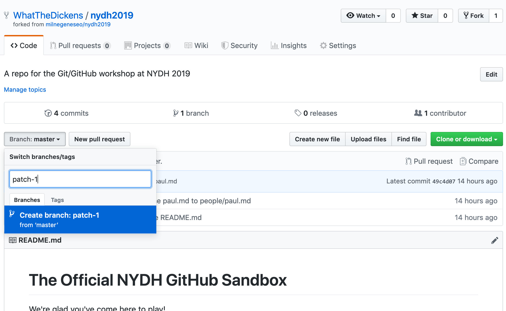

# Branching

**Branching** is an important concept in Git. By default, every repository has a branch named `master`. The master branch is usually where you'll find a project's files in their most up-to-date form.

If you fork a project for the purpose of contributing to the original, source project, you can make edits to the files in the `master` branch of your fork, then submit these edits to be included on `master` in the source via a **pull request** (to be explained shortly).

However, another approach — and the one we'll take here — is to create a new branch from your master and make the edits on the branch. Once you're satisfied with your edits, you can open a pull request to **merge** your secondary *branch* with the source project's *master*. (We'll get to merging shortly as well.)

Why do this? For one thing, working on a new branch enables you to keep *your* master in sync with the *source's* master. After all, your edits may not be accepted into the source project, and you may find it less confusing to keep your fork's master free of potentially confusing changes.

So let's do this now. You should be looking at `https://github.com/youraccountname/nydh2019`. You can create a new branch by clicking on the "Branch" dropdown and typing in any name you want (as long as it doesn't have spaces or non-alphanumeric characters in it). You might name it `patch-1` for example.

Make sure you're inside your own account and not the `milnelibrary` account! You don't have permission to create a branch in the source repository.

Click the dropdown ...

Then name and create the branch.

Very soon, we'll create a new file on the branch you've just created. But first, we need to understand something about how project files are written.

[<< Previous](sandbox.md) | [Next >>](mrkdwn.md)