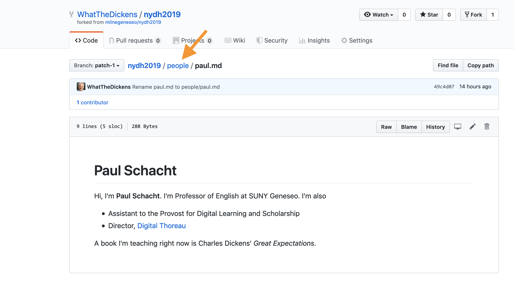
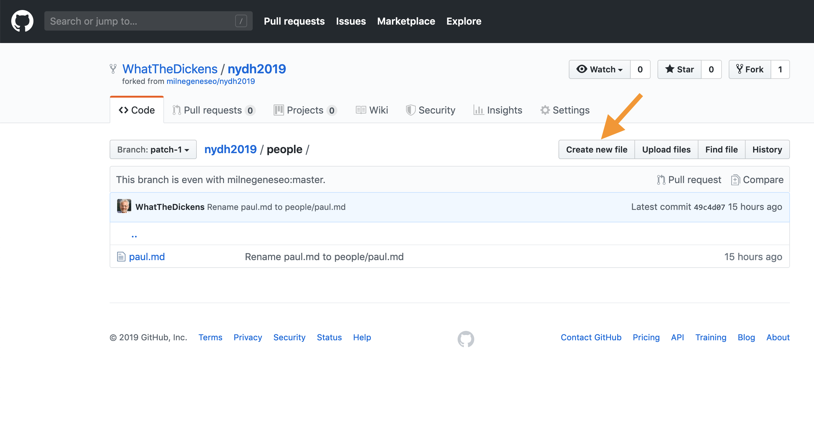
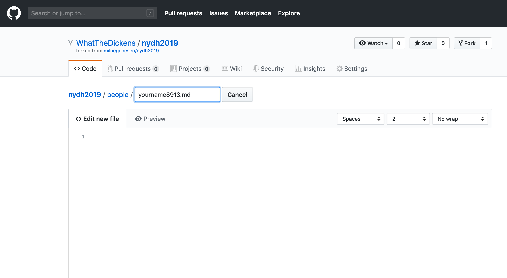
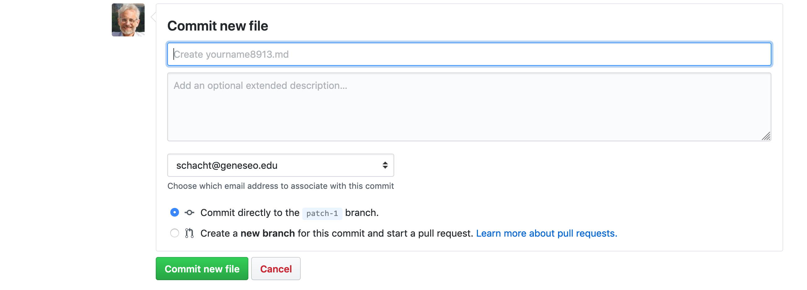

# Create and commit a file

Now that you know what Markdown looks like, it's time to use some in a file that you'll create.

First, navigate back up to `people` by clicking `people` in the path above the file contents. 



Now create your own file by click the `Create new file` button.



Name your file using your name and some numbers to reduce conflicts when we all open pull requests in just a moment. Alternatively, you could use both your first and last names (no spaces, thought!) or perhaps the name of a favorite literary character.  

***Be sure that the file name ends with the `.md` extension.***



Now you can type in the body of the file. Maybe tell us a little bit about yourself using some markdown. Remember ...

```
# Level-one heading (you need the space after #)

- bullet
- bullet

(Put blank lines above and below your list.)

*one asterisk on either side for italics*

**two on either side for bold**

[Linked text](some_url)

Create links by putting linked text in brackets, immediately followed (no space) by the url for the link in parentheses.
```
Once you're happy with the file, it's time to *commit* it to your branch. Scroll down, write a brief message about your commit if you like (or just go with the pre-filled message), check that your commit is going to your branch, then hit the green `Commit new file` button.



[<< Previous](mrkdwn.md) | [Next >>](pullrequest.md)