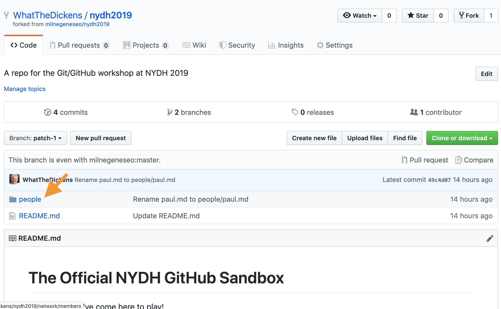
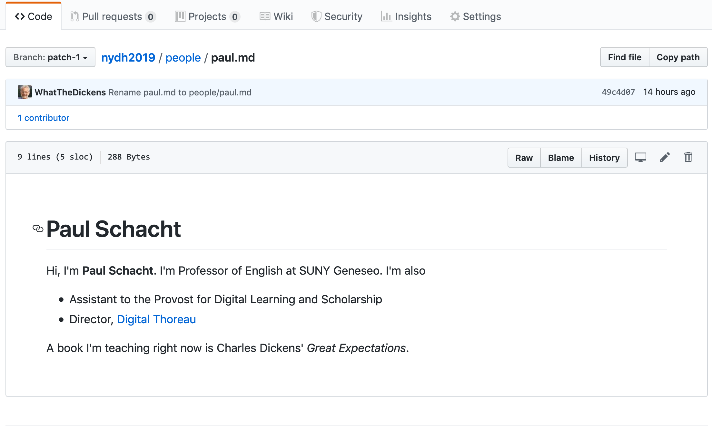
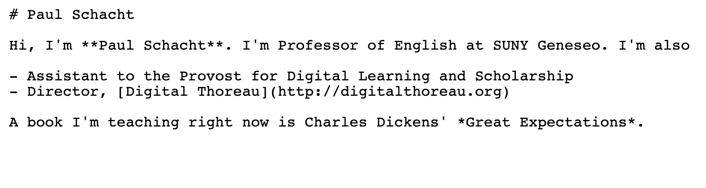

# Markdown

You now have a new branch in your fork of the `nydh2019` repository. It's almost time to play in the sandbox!

The "Branch" button of your repository should now say `Branch: patch-1` (if that's what you called it). We'll stay on the new branch for now, but notice that you can use the dropdown to switch from one branch to the other or to create additional branches.

Nothing we do on our new branch will affect anything in `master`. That's the point of creating a new branch.

Click the one the word `people` next to the folder icon to navigate into the `people` directory.

Inside `people`, you'll find a file named `paul.md`. Click the filename and you should see this.

The file has some nice formatting: a header in **bold** font, some bullet points, a link, and the title of a novel in *italics*. Where does this formatting come from?

Click the "Raw" button toward the upper right of the file, and your browser should show you something like this.

What you're looking at is a lightweight markup language called *markdown*. When you format your text using markdown, GitHub understands markdown's symbols for things like bullets and italics and automatically transforms them into html, the basic formatting language of the web.

GitHub knows what to do with the file because of the `.md` at the end of the file — the file's extension.

Click the back button of your browser to return to the html view of the file.

[<< Previous](branching.md) | [Next >>](createfile.md)

