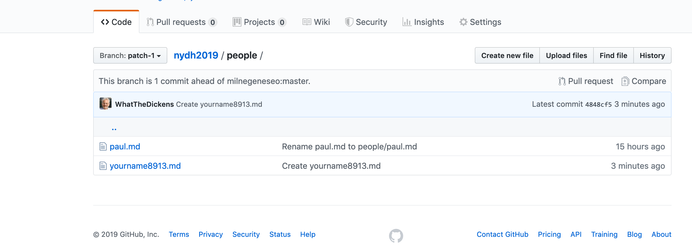

# Opening a pull request

You've forked the source repository, created a new branch, added a file to the repository, and committed your changes.

Every time you make a new commit in Git, the software takes a snapshot of everything in the project at that stage of its history. It's these successive snapshots that make it possible to track back through the project's history,  see all the changes made to any file, compare across file versions, and revert files to earlier versions as needed.

Now it's time to contribute your changes — made on your `patch-1` branch to keep your fork of `master` clean — to the main project.

You can see that you've left the master branch unaltered by using the `Branch` dropdown to switch back and forth between branches. Your new file should be listed in `patch-1` (if that's the name you used) but not in `master`.

Make sure you're on the branch you created, and click the `Pull request` button.

You should see something similar to the screen grab below. Notice that you've been taken to the source repository, `milnegeneseo/nydh2019`, because that's where you want your new file to go. You can also see that you're asking to merge from your branch (in this case named `patch-1`) to `master` in the source repository.

Leave a short comment explaining your change (you can't open your request without one), then scroll down and click the green `Create pull request` button.

[<< Previous](createfile.md) | [Next >>](reviewpull.md)