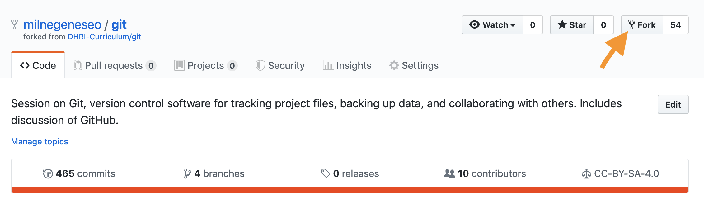
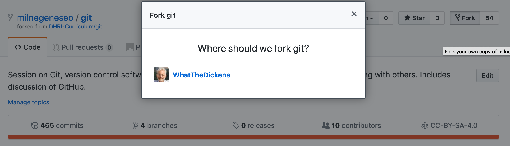

# Repos and Forks

## Repos

Git stores project files in a *repository*, often called a *repo* for short. The repository contains not only the files themselves but all the tracking information associated with them.

Right now, you're inside a repository named `git` that belongs to the GitHub account holder `milnegeneseo`. Hence the URL <https://github.com/milnegeneseo/git>. 

Remember, though, that GitHub doesn't have to be the only place that a repository lives. If you were using Git from the command line, you could [clone](https://help.github.com/en/github/creating-cloning-and-archiving-repositories/cloning-a-repository-from-github) this repository to your own machine and work with the files there.

For now, though, we're just going to work with repositories via GitHub.

## Forks

So how do you get your own repository? There are two ways. You can either create a new repository in your own account or fork a repository from someplace else.

We're going to start with the latter approach.

Go ahead and fork this repository to your own account so that you have your own copy of `git` at the URL `<https://github.com/youraccountname/git>`. This will take you away from `<https://github.com/milnegeneseo/git>`, but not to worry: you'll just be looking at the same files from inside your own account.

Once you've done that, though, you'll need to find your way to this page inside `<https://github.com/youraccountname/git>`. (Hint: Click on the folder named `sections`, then on the file named `reposforks.md`)

To fork this repository, click the "Fork" button in the upper right corner of the page.

[<< Previous](../README.md) | [Next >>](sandbox.md)

