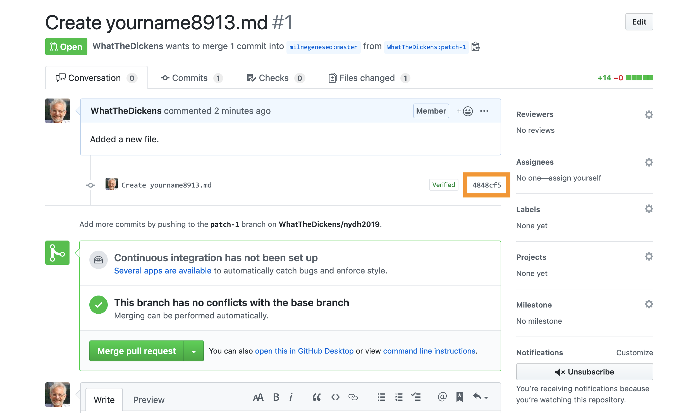

# Reviewing a pull request

Our emphasis in this workshop has been on forking and contributing to an existing project. But you might be interested in what the owner of the source project sees when you make your pull request. So here's the view of the request that we just created on the previous page of this tutorial:

From here, the owner can merge the submitted changes into the source repository's master branch, leave a comment, or review the changes in detail. Clicking the hash for the request (highlighted in the screen grab above) opens a window where the reviewer can leave general or line-by-line comments, perhaps requesting additional changes before the changes can be merged.

[<< Previous](pullrequest.md) | [Next >>](final.md)

